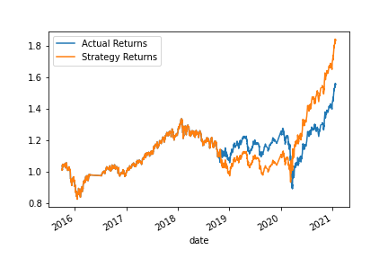

# Machine Learning Trading Bot

This application is an algorithmic trading bot that learns and adapts to new data and evolving markets. Specifically. this application:

* Implements an algorithmic trading strategy that uses machine learning to automate trade decisions.

* Adjusts input parameters to optimize the trading algorithm.

* Trains a new machine learning model and compares its performance to that of a baseline model.

This application also includes a report below that compares the performance of the machine learning models based on the trading predictions that each makes and the resulting cumulative strategy returns.

---

## Report

### Conclusions About Performance of the Baseline Trading Algorithm

Below are the cumulative returns plotted that show the actual returns vs. the strategy returns of the baseline scenario.


### Results from Changing the Training Window Timeframe

Below are the cumulative return plotted that show the scenario where I changed the training window to 6 months. 



Q. What impact resulted from increasing or decreasing the training window?

A. Changing the training window to 6 months resulted in worse performace over the baseline scenario.


### Results from Changing the SMA Windows

Below are the cumulative return plotted that show the scenario where I changed the SMA short window to 50 and the long window to 200.


Q. What impact resulted from increasing or decreasing either or both of the SMA windows?

A. Increasing the SMA windows to 50/200 performed worse compared to the baseline scenario.


### Results from Using a New Machine Learning Classifier (adaBoost)


INSERT HERE -- PNG image of the cumulative product of the actual returns vs. the strategy returns for this updated trading algorithm


Q. Did this new model perform better or worse than the provided baseline model?

A. This model performed considerably better than the baseline that used the SVC.

Q. Did this new model perform better or worse than your tuned trading algorithm?

A. This model also performed better than the tuned SVC model.

### Summary Evaluation Report

Final conclusions and analysis. Findings supported by using the PNG images that were created.

* Using the SVC algorithm, the baseline model performed best.

* Using the LG alogrithm performed better in all cases than the SVC models.

---


## INSTALLATION

1. Clone this repository by opening your terminal and entering the following commands:

```
  git clone https://github.com/jgrichardson/machine_learning_trading_bot.git
```

---

## USAGE

This application runs as a Jupyter Lab notebook. Open your terminal, navigate to the cloned directory, and type:

```
  jupyter lab
```

---

## License

The source code for the application is licensed under the MIT license, which you can find in the LICENSE file in this repo.

